# INFORME CONJUNTOS DIFUSOS
### _Dilan Joseph Sanchéz Silva_ $2380492$
### _Santiago Andrey Morales Valencia_ $2380753$
***
### Código

```scala
package taller

import scala.annotation.tailrec

class ConjuntosDifusos {

  type ConjDifuso = Int => Double

  // Funcion pertenece recibe un numero entero (elem) y un conjunto difuso (s)
  def pertenece(elem: Int, s: ConjDifuso): Double = s(elem)

  // Funcion grande aqui construimmos un conjunto difuso de numeros grandes
  def grande(d: Int, e: Int): ConjDifuso = {
    if (d < 1) throw new IllegalArgumentException("d debe ser mayor o igual a 1") // d entero mayor o igual a 1
    if (e <= 1) throw new IllegalArgumentException("e debe ser mayor que 1")  // e entero mayor a 1

    (n: Int) => { // la funcion grande va a devolver otra funcion
      if(n < 0) 0.0 // si n es un numero negativo devuelve 0.0 porque no es grande
      else{
        val base = n.toDouble / (n.toDouble + d.toDouble) // aqui dividimos y obtenemos el valor de n si es mas cercano a 0 o a 1
        math.pow(base, e.toDouble) // luego de obtener el valor de n lo elevamos a (e) asi aseguramos que tan grande o pequeño es
      }
    }
  }

  // Funcion complemento recibe un conjunto difuso (c) y nos devuelve otro conjunto difuso en el cual nos respresenta su complemento
  def complemento(c: ConjDifuso): ConjDifuso = {
    (s:Int) => 1.0 - c(s) // la formula del complemento de un conjunto difuso es fA(X) = 1 - fA(X) ==> FC(S) = 1.0 - c(s)
  }

  // Funcion union recibe dos cunjuntos difusos (cd1 y cd2) y nos devuelve un nuevo conjunto difuso en el que se ve la union de ambos
  def union(cd1: ConjDifuso, cd2: ConjDifuso): ConjDifuso = { // calcula el grado de cd1 y cd2
    (s:Int) => math.max(cd1(s), cd2(s)) // aqui devuelve el valor maximo entre ambos con math.max
  }

  // Funcion interseccion recibe dos conjuntos difusos (cd1 y cd2) y nos devuelve un nuevo conjunto difuso en el que la interseccion de ambos
  def interseccion(cd1: ConjDifuso, cd2: ConjDifuso): ConjDifuso = { // calcula el grado de cd1 y cd2
    (s:Int) => math.min(cd1(s), cd2(s)) // aqui devuelve el valor minimo entre ambos con math.min
  }

  def inclusion(cd1: ConjDifuso, cd2: ConjDifuso): Boolean = {
    @annotation.tailrec
    def aux(n: Int): Boolean = {
      if  (n > 1000) true
      else if (cd1(n) > cd2(n)) false
      else aux(n + 1)
    }
    aux(0)
  }

  def igualdad(cd1: ConjDifuso, cd2: ConjDifuso): Boolean = {
    inclusion(cd1, cd2) && inclusion(cd2, cd1)
  }

}

``` 
***
## Análisis del algoritmo
La clase `ConjuntosDifusos` contiene operaciones basiscas sobre conjuntos difusos, estos se representan como funciones de enteros a valores reales en intervalo de $[0,1]$, en el codigo utilizamos un tipo especial `ConjDifuso = Int => Double` esto en otras palabras quiere decir que un ConjDifuso es una función de enteros decimales entre 0 y 1. Por esta razón podemos hacer operaciones y combinaciones entre conjuntos de manera muy sencilla, sin  necesidad de estructuras de datos como son las listas o arreglos.
Las funciones (métodos) utilizados son los siguientes:
1. **Pertenece:** Esta función evalua el grado de pertenencia de un elemento, utilizamos la función
$$
   \mu_s(\text{elem}) = s(\text{elem})
$$
2. **Grande**: Esta función construye un conjunto difuso para los números "grandes" `grande(d: Int, e: Int)` con el parametro $d \geq 1$ y $e > 1$.
*  Para $n < 0$,  
   $$
   \mu(n) = 0
   $$
* Para $n \geq 0$,  
  $$
  \mu(n) = \left( \frac{n}{n + d} \right)^e
  $$
3. **Complemento:** Esta función calcula el complemento de un conjunto difuso representado el grado de no-pertenencia.
   $$
   \mu_{c'}(x) = 1 - \mu_c(x), \quad \forall x \in \mathbb{Z}
   $$
Basandonos en la negacion estandar de Zadeh esto es correcto, teniendo en cuenta $\mu \in [0, 1]$.
4. **Union:** Esta función calcula la unión difusa de dos conjuntos en este caso cd1 y cd2 usando el máximo.
   $$
   \mu_{cd_1 \cup cd_2}(x) = \max(\mu_{cd_1}(x), \mu_{cd_2}(x)), \quad \forall x
   $$
5. **Interseccion:** Esta función calcula la intersección difusa usando el mínimo.
   $$
   \mu_{cd_1 \cap cd_2}(x) = \min(\mu_{cd_1}(x), \mu_{cd_2}(x)), \quad \forall x
   $$
6. **Inclusion:** Esta función comprueba si $cd_1 \subseteq cd_2$ (subconjunto difuso), en otras palabras
   $$
   \mu_{cd_1}(x) \leq \mu_{cd_2}(x) \quad \forall x
   $$
Además usamos recursión de cola `@tailrec` para aproximar sobre $x = 0$ a $1000$ (teniendo en cuenta que los valores más allá de ese rango no son relevantes).

* Si $\exists n \leq 1000$ tal que $\mu_{cd_1}(n) > \mu_{cd_2}(n)$, retorna `false`.
* De lo contrario, retorna `true` (aproximación).
7. **Igualdad:** Esta función comprueba la igualdad difusa $cd_1 = cd_2$ si $cd_1 \subseteq cd_2$ y $cd_2 \subseteq cd_1$, en otras palabras 
$$
  \mu_{cd_1}(x) = \mu_{cd_2}(x), \quad \forall x
  $$
Las operaciones algebraicas como pertenece, complemento, unión, intersección manejan una complejidad de $O(1)$ y las operaciones de tipo relacional como inclusion e igualdad al recorrer un rango de valores para comparar conjuntos completos su complejidad es de $O(1000)$.

***
## Demostración del algoritmo
### _Base_
Para conjuntos difusos triviales, como un conjunto singleton o vacío,  
las operaciones se comportan como en la teoría clásica.
Por ejemplo, considera un conjunto difuso $A$ donde  
$\mu_A(0) = 0.5$ y $\mu_A(n) = 0$ para $n \neq 0$ (grado base).

* **Complemento:**  

  $\mu_{\bar{A}}(0) = 1 - 0.5 = 0.5$, y $1$ en otros puntos.  
  Cumple $\mu_A(x) + \mu_{\bar{A}}(x) = 1.$

* **Unión con vacío** ($B$ donde $\mu_B(x) = 0$):  
  $\max(\mu_A(x), 0) = \mu_A(x).$

* **Intersección con universo** ($U$ donde $\mu_U(x) = 1$):  
  $\min(\mu_A(x), 1) = \mu_A(x).$

* **Inclusión:**  
  $A \subseteq U$ ya que $0.5 \le 1$, verificado en la recursión base  
  (un solo paso si $n = 0$ es el foco).


Para `grande(d = 1, e = 2)` en $n = 0$:  

$$
\mu(0) = \left(\dfrac{0}{0 + 1}\right)^2 = 0
$$ esto es correcto para “no grande”.

### _Paso inductivo_
Si interpretamos que todas las operaciones funcionan bien cuando nos limitamos a un rango pequeño de números, como el 0 hasta k (por ejemplo, $k=5$, solo chequeamos hasta el 5). Ahora, queremos ver qué pasa si agregamos un número más, el $k+1$ (como el 6), y confirmar que todo sigue marchando sin problemas.
1. **Con grande:** Pensemos que para números hasta $k$ la fórmula da valores correctos entre $0 y 1$ y que el grado de pertenencia va subiendo poco a poco a medida que los números crecen. Cuando agregamos $k+1$, la base de la fórmula $\frac{n}{n + d}$ será un poquito más grande que para $k$, porque el numerador crece más que el denominador. Luego, elevándola a la potencia e, el nuevo valor será mayor que el anterior, manteniendo esa idea de que números más grandes tienen mayor pertenencia al conjunto `grande`. Así, se extiende sin romper nada.
2. **Para opercaciones como complemento, unión e intersección:** Para los números hasta $k$, ya sabemos que dan resultados correctos por lo que asumimos.  
   Ahora, para el nuevo número $k + 1$, simplemente aplicamos las mismas reglas:

* `Complemento:` resta el grado de $1$, es decir, $1 - \mu(k + 1)$, lo que siempre da un valor entre $0$ y $1$.

* `Unión:` tomamos el mayor de los dos grados en $k + 1$:
  $$
  \mu_{A \cup B}(k + 1) = \max(\mu_A(k + 1), \mu_B(k + 1))
  $$
  Este resultado no puede salirse de los límites $[0,1]$.

* `Intersección:` tomamos el menor:
  $$
  \mu_{A \cap B}(k + 1) = \min(\mu_A(k + 1), \mu_B(k + 1))
  $$

Para calcular el valor de un conjunto difuso en el punto $k + 1 $ solo necestiamos los valores en ese punto, no dependemos de lo que pasa en otros puntos.
***
## Ejecución paso a paso
Caso: Con un conjunto difuso *"grande"* con `d = 2`, `e = 2`, calculemos su complemento, unión con otro conjunto simple y verifiquemos inclusión.  

**Evaluemos para \( n = 0, 3, 10 \) (pasos representativos).**

1. Creación de `grande(d = 2, e = 2)` → Conjunto \( G \)**

* Para 
  $$ 
  ( n = 0 ):  
  base = ( \frac{0}{0 + 2} = 0 ),  
  ( \mu_G(0) = 0^2 = 0.0 )
  $$

* Para 
  $$ 
  ( n = 3 ):  
  base = ( frac{3}{3 + 2} = 0.6 ),  
  ( \mu_G(3) = 0.6^2 = 0.36 ).
  $$

* Para 
  $$
  ( n = 10 ):  
  base = ( \frac{10}{10 + 2} \approx 0.833 ),  
  ( \mu_G(10) = 0.833^2 \approx 0.694 ).
  $$
2. Complemento de $( G \rightarrow \overline{G} )$**

$$
\begin{aligned}
\mu_{\overline{G}}(0) &= 1 - 0 = 1.0, \\
\mu_{\overline{G}}(3) &= 1 - 0.36 = 0.64, \\
\mu_{\overline{G}}(10) &= 1 - 0.694 \approx 0.306.
\end{aligned}
$$

3. Otro conjunto simple \( P \)
(pequeños, simulado como $\mu_P(n) = \frac{1}{1 + n}$, por ejemplo:

$$
\begin{aligned}
\mu_P(0) &= \frac{1}{1 + 0} = 1.0, \\
\mu_P(3) &= \frac{1}{1 + 3} = 0.25, \\
\mu_P(10) &= \frac{1}{1 + 10} \approx 0.091.
\end{aligned}
$$

4. Unión $( G \cup P )$

* Para $( n = 0 ): ( \max(0, 1) = 1.0 )$.
* Para $( n = 3 ): ( \max(0.36, 0.25) = 0.36 )$.
* Para $( n = 10 ): ( \max(0.694, 0.091) \approx 0.694 )$.

5. Intersección $( G \cap P )$

* Para $( n = 0 ): ( \min(0, 1) = 0.0 )$. 
* Para $( n = 3 ): ( \min(0.36, 0.25) = 0.25 )$. 
* Para $( n = 10 ): ( \min(0.694, 0.091) \approx 0.091 )$.


6. Inclusión $( P \subseteq G )$

* **Recursión `aux(θ)`**:  
  $( \mu_P(0) = 1 > \mu_G(0) = 0 \Rightarrow \text{retorna `false`} ) inmediatamente$.
* (No es subconjunto, ya que **pequeños** no son **grandes**).


7. Inclusión $( G \subseteq \overline{G} )$

* Para cada $( n \leq 1000 )$:  
  $( mu_G(n) \leq 1 - mu_G(n) )$ 
  siempre ya que 
  $( mu_G(n) \leq 0.5 )$ 
  No, pero se verifica punto a punto).

* **Ejemplo:**  
  $( n = 0: 0 \leq 1 )$  
  $( n = 3: 0.36 \leq 0.64 )$  
  $( n = 10: 0.694 > 0.306 \Rightarrow ) En ( n = 10 )$, falso (no incluido).

- La recursión detecta en \( n = 10 \) y retorna `false`.
8. **Igualdad \( G \) y \( \overline{G} \)?**

* `inclusion(G, G)`:  
  $$\mu_G(n) \le \mu_G(n) \quad \text{para todo } n \le 1000 \;\rightarrow\; \texttt{true}.$$

* Inclusion mutua → `true`.

**Resultado final:** Las pruebas realizadas con los valores representativos $( n = 0, 3, 10 )$ confirman que las operaciones definidas,  
como la generación del conjunto “grande”, el complemento, la unión y la intersección,  
funcionan de manera correcta y mantienen los grados dentro del intervalo \( [0, 1] \).

Las operaciones puntuales se llevan a cabo de forma local y en **tiempo constante**,  
mientras que las verificaciones globales (`inclusion`, `igualdad`) requieren recorrer un rango finito,  
limitado a \( 1000 \), lo que asegura **terminación** y **costo predecible**.

En la práctica, esto demuestra que la implementación es:

- **Correcta:** los resultados se mantienen dentro del dominio válido $ [0, 1] $.
- **Eficiente:** las operaciones locales no dependen del tamaño del conjunto.
- **Adecuada:** se puede aplicar a dominios discretos y limitados.


*** 
## _Mermaid_

```mermaid
graph TD
    subgraph Creacion
        A["Instancia ConjuntosDifusos"]
        A --> B["grande(d=2, e=2) → G"]
        B --> C1["μ_G(0) = (0/2)^2 = 0"]
        B --> C2["μ_G(3) = (3/5)^2 = 0.36"]
        B --> C3["μ_G(10) = (10/12)^2 ≈ 0.694"]
    end

    subgraph Operaciones
        B --> D["complemento(G) → Ḡ"]
        D --> E1["μ_Ḡ(0) = 1 - 0 = 1"]
        D --> E2["μ_Ḡ(3) = 1 - 0.36 = 0.64"]
        D --> E3["μ_Ḡ(10) ≈ 1 - 0.694 = 0.306"]

        A --> F["Conjunto P (pequeños): μ_P(n) = 1/(1+n)"]
        F --> G1["μ_P(0) = 1"]
        F --> G2["μ_P(3) = 0.25"]
        F --> G3["μ_P(10) ≈ 0.091"]

        B --> H["union(G, P) → U"]
        H --> I1["max(0,1) = 1 (n=0)"]
        H --> I2["max(0.36,0.25) = 0.36 (n=3)"]
        H --> I3["max(0.694,0.091) ≈ 0.694 (n=10)"]

        B --> J["interseccion(G, P) → I"]
        J --> K1["min(0,1) = 0 (n=0)"]
        J --> K2["min(0.36,0.25) = 0.25 (n=3)"]
        J --> K3["min(0.694,0.091) ≈ 0.091 (n=10)"]
    end

    subgraph Verificaciones
        F --> L["inclusion(P, G)"]
        L --> M["aux(0): 1 > 0 → false"]

        B --> N["inclusion(G, Ḡ)"]
        N --> O["aux(0): 0 ≤ 1, aux(1)... hasta n=10: 0.694 > 0.306 → false"]

        B --> P["igualdad(G, G)"]
        P --> Q["inclusion(G,G) = true && inclusion(G,G) = true → true"]
    end

    C1 --> E1
    C2 --> E2
    C3 --> E3
    G1 --> I1
    G2 --> I2
   
```

